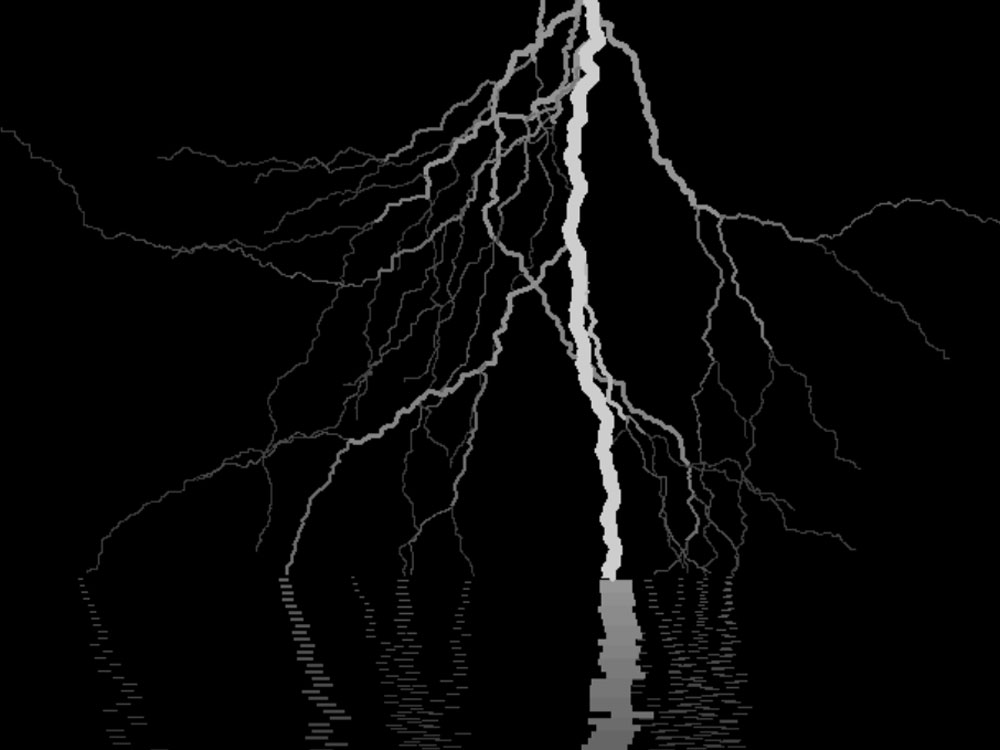

# Procedural Lightning

An algorithm to procedurally generate lightning bolts.



## Setup

```
git clone https://github.com/ChaseLean/procedural-lightning
```
## Notes
For an application of this algorithm, take a look at the <a href="https://github.com/ChaseLean/tesla-coil-simulator">Interactive Tesla Coil Simulator</a>.
